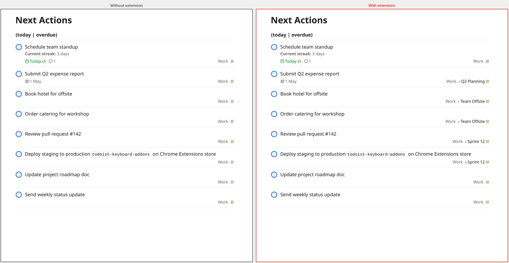

Todoist Keyboard Add-ons
=========================

A small, focused extension for Todoist.  

A Chrome extension that adds extra keyboard shortcuts and quality-of-life features to the [Todoist](https://app.todoist.com) web app. All shortcuts are configurable via the extension's options page.

## Features

### Parent task label in filter / search views

When browsing a filter or search result, Todoist shows the project name (e.g. `Work #`) in the bottom-right corner of each task. For subtasks this gives no context about what the parent task is.

With this feature enabled, the label is replaced with **`Project › Parent Task Title`** for subtasks. Top-level tasks are unaffected. This relies on Todoist's local IndexedDB cache — no extra API calls are made.



Can be toggled on/off from the extension's options page.

## Keyboard shortcuts

### Task list

| Shortcut       | Action                                             |
|----------------|----------------------------------------------------|
| Alt+Shift+Up   | Move the focused task up (simulates drag-and-drop) |
| Alt+Shift+Down | Move the focused task down                         |
| Alt+Shift+Home | Move the focused task to the top of the list       |
| Alt+Shift+End  | Move the focused task to the bottom of the list    |
| Alt+K          | Open the first external link in the focused task   |
| PageUp         | Move keyboard focus up by one page                 |
| PageDown       | Move keyboard focus down by one page               |
| Home           | Move keyboard focus to the first task              |
| End            | Move keyboard focus to the last task               |

### Task detail (modal)

| Shortcut | Action                                                                                           |
|----------|--------------------------------------------------------------------------------------------------|
| Alt+Up   | Navigate to the parent project via the breadcrumb link                                           |
| Alt+O    | Open the "More actions" menu                                                                     |
| Shift+G  | Navigate to the task's project (extends native Shift+G to work inside the modal)                 |
| G        | Hint mode — shows two-letter labels on every subtask; type a label to complete/uncomplete it (G prefix) or open its "More actions" menu (O prefix) |
| PageUp   | Scroll the subtask list up by one page                                                           |
| PageDown | Scroll the subtask list down by one page                                                         |
| Home     | Scroll the subtask list to the top                                                               |
| End      | Scroll the subtask list to the bottom                                                            |
| Alt+H    | Toggle show/hide completed sub-tasks                                                             |

## Installation

1. Clone or download this repository.
2. Open `chrome://extensions` (or `brave://extensions`).
3. Enable **Developer mode**.
4. Click **Load unpacked** and select the repository folder.

## Configuration

Click the extension's **Options** link on the extensions page to customise shortcuts and toggle features. Settings are synced across devices via `chrome.storage.sync`.

## Publishing (maintainer notes)

### Releasing

```bash
# bump version in manifest.json, then:
git add manifest.json
git commit -m "Bump version to X.Y"
git tag vX.Y
git push && git push --tags
```

The workflow (`.github/workflows/release.yml`) will zip the production files and attach `extension.zip` to a GitHub Release.

Download `extension.zip` from the release assets and upload it manually via the [Chrome Web Store Developer Dashboard](https://chrome.google.com/webstore/devconsole).
